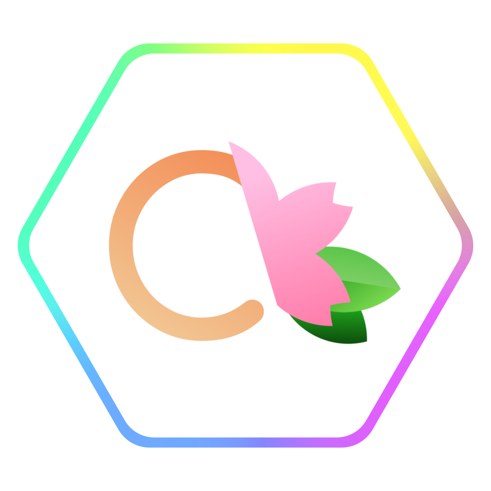

<h1 align="center">

Cocoa Framework 2
</h1>

Cocoa Framework 是一个基于 mirai 的 QQ 机器人开发框架，致力于降低 QQ 机器人的开发难度，使更多人能定制属于自己的 QQ 机器人

项目名称来源于
[Koi](https://zh.moegirl.org.cn/Koi)
作品
[《请问您今天要来点兔子吗？》](https://zh.moegirl.org.cn/%E8%AF%B7%E9%97%AE%E6%82%A8%E4%BB%8A%E5%A4%A9%E8%A6%81%E6%9D%A5%E7%82%B9%E5%85%94%E5%AD%90%E5%90%97)
中的
[保登心爱](https://zh.moegirl.org.cn/%E4%BF%9D%E7%99%BB%E5%BF%83%E7%88%B1)

 

# 开始使用

尝试快速入门教程：
- [你好，Cocoa！](./Docs/Tutorial/hellococoa.md)

查看常见功能的案例：
- [复读机](./Docs/Samples/Repeater.md)
- [Cocode](./Docs/Samples/Cocode.md)

教程、API 文档和更多案例详见 [Cocoa Framework 文档](./Docs/index.md)

 

# 相较于 1.x 版本的区别

Cocoa Framework 2 在继承了 1.x 版本核心思路的同时进行了完全的重构，尽可能地使开发者只需考虑功能本身。同时，与 mirai-api-http 的通讯也改为使用 Cocoa Beans，便于及时跟进 mirai 的新特性。  
更多新特性请参阅 [Cocoa Framework 2 中的新特性](./Docs/Whatsnew/NewFeatures.md) 和 [更新日志](./Docs/Whatsnew/UpdateLog.md)

 

# 联系我们
您可以直接通过 Issue 向我们提供反馈。  
如果希望与项目开发者和其他用户交流，欢迎加入 QQ 群（766230870）  
如果希望加入我们，欢迎联系上述交流群群主。